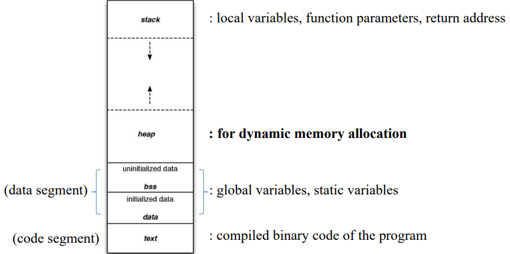
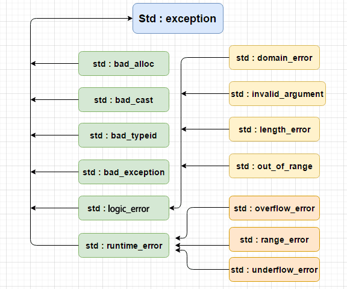

## Object-Oriented Programming

### Core Concepts

- **Encapsulation**: Bundling data and operations together
  - Facilitates management and access control
  - Class is used to implement encapsulation, with access permissions like public, etc., namespace
- **Inheritance**: 
  1. Reduces duplicate code
  2. Increases class coupling
  3. Prerequisite for polymorphism
- **Polymorphism**

## Memory Management

### Heap vs Stack



- **Management**: Stack is managed by the compiler, heap is manually allocated by the programmer through new
- **Fragmentation**: Stack follows LIFO (Last In, First Out) with no fragmentation issues as managed by the system, heap manual allocation may lead to fragmentation
- **Growth Direction**: Stack grows toward decreasing addresses, heap grows toward increasing addresses
- **Allocation**: Stack has dynamic and static allocation, static by alloc function, dynamic by compiler; heap is dynamic allocation
- **Efficiency**: Stack efficiency is higher than heap due to system operations at the lower level
- **Large Memory Blocks**: Heap allocation is better for large blocks, but be mindful of heap/stack overflow issues

### Dynamic Memory Allocation

#### New and Malloc

- **malloc**: A function that returns void *, **new**: An operator that returns a pointer
- **Parameters**: malloc takes size in bytes, new takes initialization values
- **Class Allocation**: new can be used for class allocation, malloc cannot (mainly due to initialization issues)
- **Overloading**: new can be overloaded (for classes), malloc cannot
- **Error Handling**: malloc returns 0 on error, new throws an exception

#### Memory Leaks

- **Causes**: Heap leaks
  - Class destructors not calling new and delete
  - delete not using []
- **Solutions**:
  - Smart pointers
  - No null pointers
  - Use string → string memory management internally, and it's fast and well-optimized
  - RAII: Allocates memory in object constructor and releases it in the destructor

## Type Casting

1. **static_cast&lt;T&gt;(val)**: Only useful when type and expression can be implicitly converted to each other
   - Type checking at compile time
   - Safe for upcast (derived -> base)
   - Unsafe for downcast (base -> derived)
   - Commonly used for **numeric conversion** (float->int)

2. ***dynamic_cast&lt;T*&gt;(ptr)**: **Conversion of classes (downcasting), only applicable to pointers or references**
   - Type checking at run time
   - Used for polymorphic type conversion
   - Safe for downcast
     - If base class pointer is not pointing to a specified derived class object, dynamic_cast of base to derived pointer **returns null pointer (0)**
   - dynamic_cast can only downcast polymorphic types (base class should have at least one virtual function)

3. ***const_cast&lt;T*&gt;(ptr)**: Performs only one type of conversion - removing const/volatile properties, can only be used for pointers or references
   - const_cast&lt;type-name&gt;(expression)
   - const int pop=100;

4. ***reinterpret_cast&lt;T*&gt;(ptr)**
   - Used for simple bit reinterpretation
   - Allows conversion of any pointer to any other pointer type (such as char* to int* or One_class* to Unrelated_class* conversions, but is not safe)
   - Also allows conversion of any integer type to any pointer type and vice versa
   - A practical use of reinterpret_cast is in hash functions, i.e., mapping values to indices in a way that two different values end up at almost the same index

### C-style Casting

Less explicit conversions that cannot perform error checking and are prone to errors.

## Runtime Type Information

- Allows the **type of an object to be determined** during program execution
- **dynamic_cast**: Conversion of polymorphic types
- **typeid operator**: Identifying the exact type of an object
  - Arguments: type-id or expression
  - Result: const type_info&
  - Only for reference, pointer

```cpp
#include <iostream>
#include <typeinfo>

class Base {
public:
   virtual void vvfunc() {}
};

class Derived : public Base {};

using namespace std;
int main() {
   Derived* pd = new Derived;
   Base* pb = pd;
   cout << typeid( pb ).name() << endl;   //prints "class Base *"
   cout << typeid( *pb ).name() << endl;   //prints "class Derived"
   cout << typeid( pd ).name() << endl;   //prints "class Derived *"
   cout << typeid( *pd ).name() << endl;   //prints "class Derived"
   delete pd;
}
int main()
{
   typeid(int) == typeid(int&); // evaluates to true
}
```

### type_info Class

Holds the type information returned by the **`typeid`** operator.
- Generated by compiler

## Operators

### Non-overloadable Operators

- **:: . * ?:** cannot be overloaded

### Ternary Operator

- **?:** ternary operator, can be used in place of if-else conditions. This is one of the operators that cannot be overloaded.

### Operator Precedence

```cpp
  1. () [] -> . :: ++ -- (postfix)
  2. ! ++ -- (prefix) + - *(dereference) & sizeof
  3. / & *
  4. << >>
  5. <= <
  6. & ^ |
  7. && || ?:
  8. == +=
```

## Function Overloading vs Overriding

| Overload (重载) | Override (重写) |
| --- | --- |
| Function overloading can be used in normal functions as well as in classes (constructor overloading is a classic example) | Function overriding applies exclusively to an **inherited class** (or in other words a subclass) |
| Compile time | Run time |
| Same scope | Different scopes |
| Different function signatures | Same function signatures |

### Memory Operations

- memset, memcpy: Can directly initialize and copy structures, enums, pointers **but not classes**

## Data Types and Sizes

### sizeof Operator


#### class

- **Empty class**: sizeof(class) = 1, each instance of the class has a unique address in memory, compiler adds one byte
- **With virtual functions**: Adds a pointer to the virtual function address
- **static/const**: Does not affect class size, static members are stored separately
- **Inheritance**: Size of inheritance is the sum of base class and inherited class

#### Integer Types

Depends on compiler. If it is a 16-bit compiler like Turbo C++, the size is 2 bytes, while if it is a 32-bit compiler like Dev-C++, g++, or Visual Studio, the size is 4 bytes.

#### Built-in Data Types

| Type | Size |
| --- | --- |
| bool, char, char8_t, unsigned char, signed char, __int8 | 1 byte |
| char16_t, __int16, short, unsigned short, wchar_t, __wchar_t | 2 bytes |
| char32_t, float, __int32, int, unsigned int, **long**, unsigned long | 4 bytes |
| double, __int64, long double, long long, unsigned long long | 8 bytes |

## Exceptions

- **When caught**: Run time

### Exception Handling Process

```cpp
double division(int a, int b)
{
   if( b == 0 )
   {
      throw "Division by zero condition!";
   }
   return (a/b);
}
 
int main ()
{
   int x = 50;
   int y = 0;
   double z = 0;
 
   try {
     z = division(x, y);
     cout << z << endl;
   }catch (const char* msg) {
     cerr << msg << endl;
   }
 
   return 0;
}
```

### Stack Unwinding

When a function terminates due to an exception, the program releases memory from the stack but does not stop after releasing the first return address. Instead, it continues releasing the stack until it finds the first try block's return address, then transfers control to the exception handler. This process is called stack unwinding. Objects in the stack also automatically call destructors.

### Exception Class Hierarchy



- Derived class: Most-derived type should be caught first, most-base type should be caught last

### Uncaught Exceptions

No matching, terminated() is called

## Variable Initialization

### Zero Initialization

- **When**:
  - Program startup, all static variables
  - Value initialization, for scalar types (int, float) and POD initialized by empty braces
  - Arrays have only a subset of their members initialized

```cpp
struct my_struct{
    int i;
    char c;
};

int i0;              // zero-initialized to 0
int main() {
    static float f1;  // zero-initialized to 0.000000000
    double d{};     // zero-initialized to 0.00000000000000000
    int* ptr{};     // initialized to nullptr
    char s_array[3]{'a', 'b'};  // the third char is initialized to '\0'
    int int_array[5] = { 8, 9, 10 };  // the fourth and fifth ints are initialized to 0
    my_struct a_struct{};   // i = 0, c = '\0'
}
```

### Default Initialization

- New keyword, scalar variables, arrays

```cpp
MyClass mc1;
MyClass* mc3 = new MyClass;
int i1;
float f;
char c;
int int_arr[3];
```

- **Constant variables** must be declared together with an initializer
  - Scalar → error
  - Class → default constructor and warning

## Preprocessor

### Include Directives

### Conditional Compilation

- #if, #ifdef, #ifndef, #else, #elif, #elifdef, #elifndef (since C++23), and #endif

```cpp
#ifdef NULL
   #define NULL 0
#endif
```

### Macro Replacement

- # and ##

```cpp
#define MKSTR( x ) #x
 
int main ()
{
    cout << MKSTR(HELLO C++) << endl;
 
    return 0;
}
```