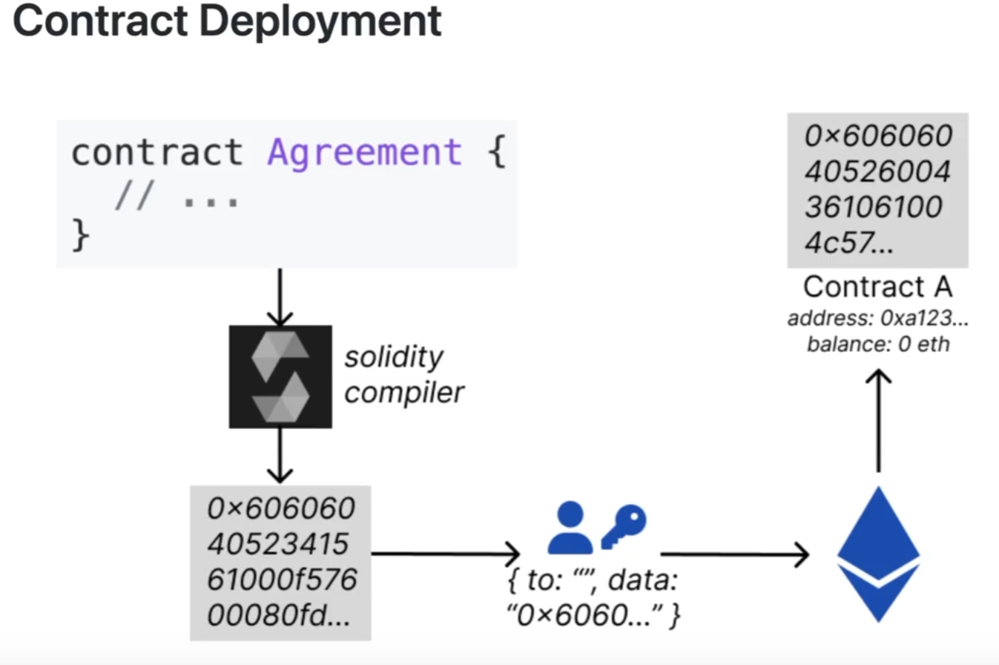

## Core Concepts

- Solidity is compiled to bytecode that the Ethereum Virtual Machine executes
- Only used to compile contracts to bytecode
- Source code -> Bytecode -> EVM node -> Network


## Data Types

### Value Types

```solidity
uint = uint256  // 0 to 2**256-1
uint8           // 0 to 2**8-1
uint16          // 0 to 2**16-1
int = int256    // -2**255 to 2**255-1
int128          // -2**128 to 2**128-1

int public minInt = type(int).min;
int public maxInt = type(int).max;
address public addr = 0x1234567890123456789012345678901234567890;
bytes32 public b32 = 0x1234567890123456789012345678901234567890123456789012345678901234;
```

### Reference Types

As an argument, you must declare the memory location: **Calldata**, **memory**, or **storage**. These types are potentially passed by reference.

#### Arrays

Arrays can be fixed or dynamic:

```solidity
contract ArrayExample {
    uint[] public nums = [1,2,3];
    uint[3] public numsFixed = [4,5,6];
    
    function examples() external {
        nums.push(4);    // 1,2,3,4
        delete nums[1];  // 1,0,3,4
        nums.pop();
        
        // Create array in memory
        uint[] memory a = new uint[](5);
        a[1] = 123;
    }
}
```

#### Mappings

- Storage only
- Cannot be passed as an argument
- Mappings nested in structs cannot be constructed; assign fields first
- Underlying use SSTORE and SLOAD with base slot 0x0

```solidity
contract MappingExample {
    mapping(address => uint) public balances;
    mapping(address => mapping(address => bool)) public isFriend;
    
    function examples() external {
        balances[msg.sender] = 123;
        uint bal = balances[msg.sender];
        uint bal2 = balances[address(1)]; // default value 0
        delete balances[msg.sender]; // 0 in this balance
        
        // Nested mapping example
        Proposal storage proposal = proposals.push();
        proposal.data = xxx;
    }
}
```

#### Structs and Enums

```solidity
struct Car {
    string model;
    uint year;
    address owner;
}

Car public car;
Car[] public cars;

function examples() external {
    Car memory toyota = Car("Toyota", 1990, msg.sender);
    Car memory lambo = Car({year: 1990, model: "Lamborghini", owner: msg.sender});
    Car storage _car = cars[0];
    _car.year = 2024;
}

enum Status {
    None,    // 0
    Pending, // 1
    Shipped  // 2
}
```

#### Strings and Bytes

- For strings less than 32 bytes, it's more efficient to store them in a fixed-size bytes32

### Variables

#### State Variables (Storage Variables)

Saved on the blockchain:

```solidity
contract Example {
    uint a = 100; // storage slot 0x0
    uint b = 200; // 0x1
    bool c = true; // 0x2
    
    constructor() {
        uint x;
        assembly {
            x := sload(0x0);
        }
    }
}
```

#### Variable Types

1. **State** variables: Saved on blockchain (storage)
2. **Local** variables: Only in local functions
3. **Global** variables: Built-in values like `msg.sender`, `block.timestamp`
4. **Memory**: Only exist when called
5. **Immutable**: Value can't be changed, saves gas

```solidity
contract StateVariables {
    uint public myUint = 123; // state variable
    
    function foo() external {
        uint x = 123; // local
        address sender = msg.sender; // global
        uint timestamp = block.timestamp;
        uint blockNum = block.number;
    }
}
```

#### Default Values

- bool: false
- uint and int: 0
- address: 0x0000000000000000000000000000000000000000
- bytes32: 0x0000000000000000000000000000000000000000000000000000000000000000

#### Constants

Constants save gas:

```solidity
uint constant MY_CONSTANT = 123;
```

## Functions

Functions in Solidity have various access levels and attributes:

### Access Levels

- **private**: Only in this contract
- **internal**: In this contract with inheritance
- **public**: Inside and outside this contract
- **external**: Only outside this contract

### Attributes

- **payable**: Can receive ether
- **pure**: Read-only, can't read/write blockchain data (completely independent)
- **view**: Read-only, can read blockchain data

```solidity
function add(uint x, uint y) external pure returns (uint) {
    return x + y;
}

function example() internal view { }
```

### Function Modifiers

Modifiers wrap functions and can take input. They don't have constructors:

```solidity
modifier whenNotPaused() {
    require(!paused, "paused");
    _;
}

function inc() external whenNotPaused {
    count += 1;
}

function dec() external whenNotPaused {
    count -= 1;
}

modifier cap(uint i) { 
    // ..code
}

function incBy(uint x) external whenNotPaused cap(x) {
    // code
}
```

Modifiers can also be used to create "sandwich" code:

```solidity
modifier sandwich() {
    count += 10;
    _;
    count *= 2;
}
```

### Special Functions

#### Constructor

Only called once when we deploy the contract:

```solidity
contract ConstructorTest {
    address public owner;
    uint public x;
    
    constructor(uint _x) {
        owner = msg.sender;
        x = _x;
    }
}
```

#### Receive

Executed when a contract is sent ether without any calldata, or when the calldata does not match a function signature:

```solidity
receive() external payable { }
```

A receive function has no name, takes no parameters, and returns nothing. It must be marked as external and payable.

#### Fallback

Executed when:
- Caller tries to call a function that doesn't exist
- Ether is sent and receive function doesn't exist
- Ether is sent, receive function exists, but msg.data is not empty

```solidity
fallback() external { }
```

#### Self-Destruct

When a contract lacks receive and fallback functions, it cannot receive Ether:

```solidity
function anyoneCanDestroy() public {
    // receiver needs to be address payable
    selfdestruct(receiver);
}
```

### Function Selector

All function calls are identified by function selectors in Solidity. These are the first 4 bytes of the hash of a function signature:

```solidity
function myFunction(address a, uint b, bytes c) public {...}

bytes4 selector = bytes4(keccak256("myFunction(address,uint256,bytes)"));
bytes4 selector = myFunction.selector;
```

### Function Outputs

Assigned return values save more gas:

```solidity
function returnMany() public pure returns (uint, bool) {
    return (1, true);
}

function named() public pure returns (uint x, bool b) {
    return (1, true);
}

function assigned() public pure returns (uint x, bool b) {
    x = 1;
    b = true;
}

function destruct() public pure {
    (uint x, bool b) = returnMany();
    (, bool b) = returnMany(); // ignore first value
}
```

## Exception Handling

### Require

```solidity
function testRequire(uint i) public pure {
    require(i <= 10, "i > 10"); // check values before
}
```

### Revert

A contract can revert a call, negating all state changes. No state changes occur, no value is transferred, but gas is spent.

```solidity
contract X {
    address owner = msg.sender;
    error Unauthorized(); // gas saving
    
    function adminOnly() external {
        if (!admin(msg.sender)) {
            revert Unauthorized();
        }
    }
    
    function ownerOnly() {
        require(msg.sender == owner, "only owner!");
    }
    
    function withdraw() external {
        uint balance = getBalance(msg.sender);
        sendBalance(msg.sender);
        assert(getBalance(msg.sender) == 0); // expect no remaining balance
    }
}
```

### Custom Errors

Customize error types with revert:

```solidity
contract Error {
    error MyError(address caller, uint i);
    
    function testCustom(uint i) public view {
        if (i > 10) {
            revert MyError(msg.sender, i);
        }
    }
}
```

### Try/Catch

```solidity
try recipient.send(amount) {
    // send success
} catch {
    // send failed
}

function divide(uint numerator, uint denominator) external {
    try this.safeDivide(numerator, denominator) returns (uint quotient) {
        result = quotient;
    } catch Error(string memory /*reason*/) {
        // handle revert() and require()
        result = 11;
    } catch (bytes memory /*lowLevelData*/) {
        // handle custom error and others
        result = 22;
    }
}
```

## Data Locations

1. **Storage**: State variables, stored in persistent storage on the blockchain
2. **Memory**: Read-only, can modify but not saved; disappears when the function completes
3. **Calldata**: Read-only data location used for function arguments; immutable and cheaper than storage

```solidity
contract SimpleStorage {
    string public text;
    
    // calldata 89000 gas
    // memory 90000 gas
    function set(string calldata _text) external {
        text = _text;
    }
    
    function get() external view returns (string memory) {
        return text;
    }
}
```

## Events

Events are used for logging:

```solidity
event Log(string message, uint val);
event IndexedLog(address indexed sender, uint val);

function example() external {
    emit Log("foo", 1234);
    emit IndexedLog(msg.sender, 789);
}
```

## Inheritance

Use the `virtual` and `is` keywords for inheritance. Child contracts inherit functions (except private) and state variables.

### Multiple Inheritance

Sequence matters: most base contracts come first.

```solidity
contract A {
    function foo() public pure virtual returns (string memory) {
        return "A";
    }
}

contract B is A {
    function foo() public pure override returns (string memory) {
        return "B";
    }
}

contract C is A, B {
    function foo() public pure override(A, B) returns (string memory) {
        return "C";
    }
}
```

### Calling Parent Constructors

```solidity
// 1. Call when initializing
contract U is S("s"), T("t") {}

// 2. Pass parameters
contract V is S, T {
    constructor(string memory _name, string memory _text) S(_name) T(_text) {}
}
```

### Calling Parent Functions

```solidity
contract A {
    function foo() public pure virtual returns (string memory) {
        return "A";
    }
}

contract B is A {
    function foo() public pure override returns (string memory) {
        A.foo();     // direct call
        super.foo(); // super keyword
        return "B";
    }
}
```

## Interfaces and Abstract Contracts

### Interfaces

1. Must be external
2. No variables

```solidity
interface MyInterface {
    function myFunction(uint256 x) external returns (uint256);
}
```

### Abstract Contracts

Abstract contracts can have variables and implementations, while interfaces only have function signatures.

```solidity
abstract contract ContractA { }
```

## Address Interaction

### Message Calls

Message calls send value and calldata to contracts:
- First message call begins the transaction (EOA � contract)
- Subsequent calls are part of the same transaction (contract � contract)
- The transaction and state changes only complete when the initial function call finishes

Global variables:
- `msg.sender`
- `msg.value` - amount in wei
- `msg.data` - calldata
- `msg.sig` - function identifier

```solidity
contract X {
    address deployer;
    address otherContract;
    
    constructor(address _otherContract) payable {
        deployer = msg.sender;
        otherContract = _otherContract;
        (bool success, ) = _otherContract.call{value: msg.value}("");
        require(success); // fail/revert the transaction
    }
}

contract Y {
    address mostRecentPayer;
    
    receive() external payable {}
    
    function withdraw() external {
        payable(msg.sender).transfer(address(this).balance);
    }
}
```

### Low-Level Calls

```solidity
function storeSum(address b) external {
    sum = b.add(5, 10);
}

// Low-level call
function storeSum(address b) external {
    (bool success, bytes memory returnData) = 
        b.call(abi.encodeWithSignature("add(uint256,uint256)", 5, 10));
    sum = abi.decode(returnData, (uint));
    require(success);
}

interface B {
    function add(uint, uint) external returns(uint);
}
```

## Libraries

Libraries do not have their own state variables. The `using...for...` statement can be used to attach library functions to a specific type.

```solidity
library StudentLibrary {
    struct Student {
        string name;
        uint id;
        uint grade;
    }

    function compareGrades(Student memory s1, Student memory s2) public pure returns(Student memory) {
        // function body
    }
}

// Using a library
using MathLibrary for uint256;
uint a;
a.add(b);
```