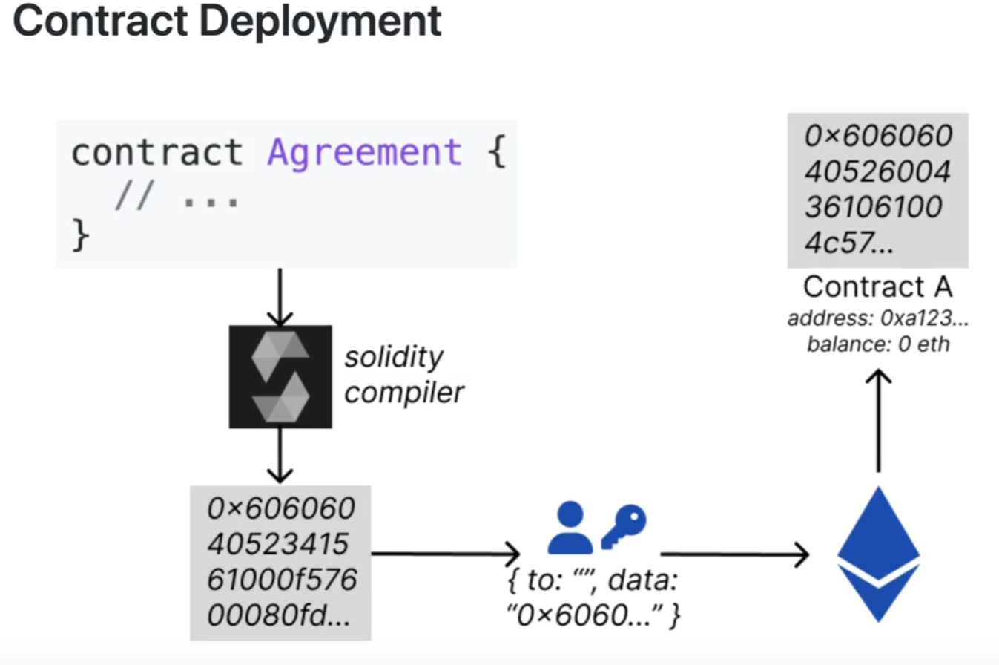

# Solidity Programming Guide

Solidity is a statically-typed, contract-oriented, high-level language for implementing smart contracts on the Ethereum platform. It's designed to target the Ethereum Virtual Machine (EVM) and is influenced by C++, Python, and JavaScript.

## What is Solidity?

Solidity is a Turing-complete programming language specifically designed for writing smart contracts on blockchain platforms, primarily Ethereum. Key concepts include:

- Compiled to bytecode that the Ethereum Virtual Machine (EVM) executes
- Used exclusively to compile contracts to bytecode
- Source code → Bytecode → EVM node → Network

## Core Features

- **Statically-typed**: Variable types are known at compile time
- **Contract-oriented**: Designed specifically for smart contracts
- **Inheritance**: Supports multiple inheritance and polymorphism
- **Libraries**: Reusable code modules
- **Complex member variables**: Structs, mappings, and nested arrays

This documentation is organized into the following sections:

1. **[Basics](/Languages/Solidity/basics)** - Data types, variables, and fundamental concepts
2. **[Functions](/Languages/Solidity/functions)** - Function types, modifiers, and special functions
3. **[Contracts](/Languages/Solidity/contracts)** - Inheritance, interfaces, and contract structure
4. **[Advanced Topics](/Languages/Solidity/advanced)** - Events, libraries, and address interaction

## Resources

- [Official Solidity Documentation](https://docs.soliditylang.org/)
- [Ethereum Developer Documentation](https://ethereum.org/developers/)
- [Remix IDE](https://remix.ethereum.org/) - Online Solidity development environment